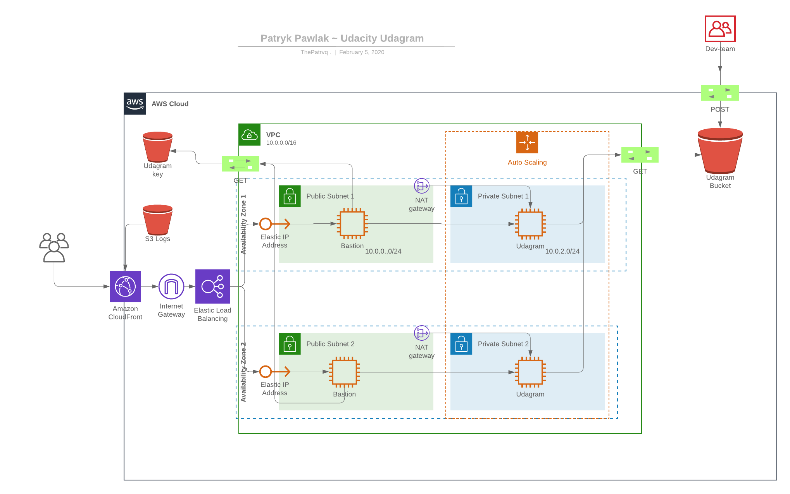

# Udacity Project nr 2 || Cloud DevOps Engineer

#### Patryk Pawlak thepatrvq@gmail.com

For more info go to https://www.udacity.com/course/cloud-dev-ops-nanodegree--nd9991

## Deploy a High-Availability Web App using CloudFormation

# PROJECT SPECIFICATION:

## Project Introduction

As your final project, you'll be faced with a real scenario.

Creating this project will give you the hands-on experience you need to confidently talk about infrastructure as code. So, for that reason, we have chosen a realistic scenario where you deploy an application (Apache Web Server) and you also pick up code (JavaScript and HTML) from S3 Storage and deploy it in the appropriate folder on the web server.

There will be two parts to this project:

You'll first develop a diagram that you can present as part of your portfolio and as a visual aid to understand the CloudFormation script.
The second part is to interpret the instructions as well as your own diagram and create a matching CloudFormation script.

## Problem

Your company is creating an Instagram clone called Udagram. Developers pushed the latest version of their code in a zip file located in a public S3 Bucket.

You have been tasked with deploying the application, along with the necessary supporting software into its matching infrastructure.

This needs to be done in an automated fashion so that the infrastructure can be discarded as soon as the testing team finishes their tests and gathers their results.

## Project Requirements

### Server spec

You'll need to create a Launch Configuration for your application servers in order to deploy four servers, two located in each of your private subnets. The launch configuration will be used by an auto-scaling group.

You'll need two vCPUs and at least 4GB of RAM. The Operating System to be used is Ubuntu 18. So, choose an Instance size and Machine Image (AMI) that best fits this spec. Be sure to allocate at least 10GB of disk space so that you don't run into issues.

### Security Groups and Roles

Since you will be downloading the application archive from an S3 Bucket, you'll need to create an IAM Role that allows your instances to use the S3 Service.

Udagram communicates on the default HTTP Port: 80, so your servers will need this inbound port open since you will use it with the Load Balancer and the Load Balancer Health Check. As for outbound, the servers will need unrestricted internet access to be able to download and update its software.

The load balancer should allow all public traffic (0.0.0.0/0) on port 80 inbound, which is the default HTTP port. Outbound, it will only be using port 80 to reach the internal servers.

The application needs to be deployed into private subnets with a Load Balancer located in a public subnet.

One of the output exports of the CloudFormation script should be the public URL of the LoadBalancer.

Bonus points if you add http:// in front of the load balancer DNS Name in the output, for convenience.

### Other Considerations

You can deploy your servers with an SSH Key into Public subnets while you are creating the script. This helps with troubleshooting. Once done, move them to your private subnets and remove the SSH Key from your Launch Configuration.

It also helps to test directly, without the load balancer. Once you are confident that your server is behaving correctly, increase the instance count and add the load balancer to your script.

While your instances are in public subnets, you'll also need the SSH port open (port 22) for your access, in case you need to troubleshoot your instances.

Log information for UserData scripts is located in this file: cloud-init-output.log under the folder: /var/log.

You should be able to destroy the entire infrastructure and build it back up without any manual steps required, other than running the CloudFormation script.

The provided UserData script should help you install all the required dependencies. Bear in mind that this process takes several minutes to complete. Also, the application takes a few seconds to load. This information is crucial for the settings of your load balancer health check.

It's up to you to decide which values should be parameters and which you will hard-code in your script.

See the provided supporting code for help and more clues.

If you want to go the extra mile, set up a bastion host to allow you to SSH into your private subnet servers. This bastion host would be on a Public Subnet with port 22 open only to your home IP address, and it would need to have the private key that you use to access the other servers.

Last thing: Remember to delete your CloudFormation stack when you're done to avoid recurring charges!

## Architecture Diagram

